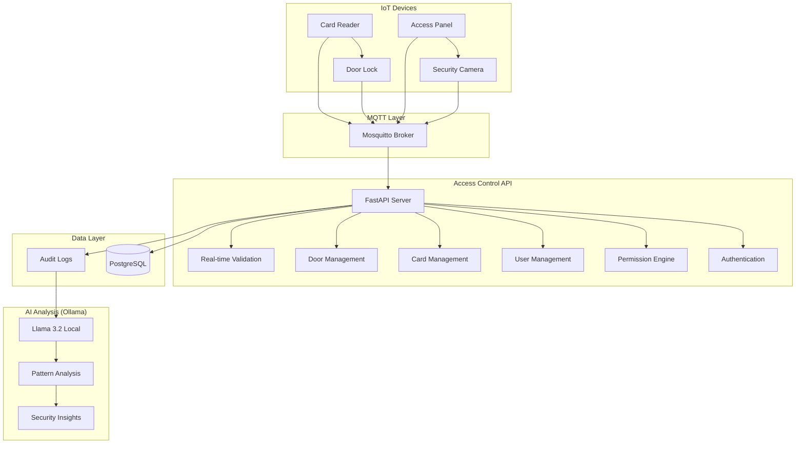

# 🚀 AI-Powered Physical Access Control System

**Enterprise-grade access control system** with real-time IoT device integration, comprehensive permission management, and Ollama-powered security analysis.

## 🎯 What does it do?

**Complete Physical Access Control Solution** that:
1. **Manages access permissions** (users, cards, doors, schedules) ✅ **COMPLETED**
2. **Validates access requests** from IoT devices in real-time ✅ **COMPLETED**
3. **Communicates bidirectionally** with IoT devices via MQTT ✅ **COMPLETED**
4. **Logs all access events** via MQTT for comprehensive audit trails ✅ **COMPLETED**
5. **Provides comprehensive APIs** for users and permissions management ✅ **COMPLETED**
6. **Analyzes access patterns** with Ollama for security insights ⚠️ **NEXT PHASE**

**Problem**: Manual access control + fragmented APIs + thousands of logs impossible to review  
**Solution**: Automated access validation + unified API management + Ollama analysis + IoT device integration for intelligent security insights

## 🤖 AI Analysis with Ollama

**Local AI Analysis** - No external API costs, privacy-focused:

```bash
# Example: Ollama analyzes access patterns
curl -X POST "http://localhost:8000/api/v1/ai/analyze" \
  -d '{
    "logs": [
      {"user": "admin", "door": "server_room", "time": "03:00", "result": "granted"},
      {"user": "admin", "door": "server_room", "time": "03:15", "result": "granted"},
      {"user": "john", "door": "main_entrance", "time": "22:30", "result": "denied"}
    ]
  }'

# Ollama Response
{
  "analysis": "Unusual pattern detected: Admin accessing server room at 3AM (outside business hours). Multiple consecutive accesses suggest maintenance activity. John's denied access at 10:30PM is normal security protocol.",
  "alerts": [
    {
      "type": "unusual_hours",
      "user": "admin", 
      "severity": "medium",
      "recommendation": "Verify if scheduled maintenance"
    }
  ],
  "summary": "1 unusual pattern, 0 security threats"
}
```

## 🏗️ System Architecture



## 🚀 Quick Start (3 minutes)

### Prerequisites
- Docker & Docker Compose
- Ollama (for AI analysis)

### Installation
```bash
# 1. Clone the repository
git clone <repo>
cd ai-access-control

# 2. Install Ollama for AI analysis
curl -fsSL https://ollama.com/install.sh | sh
ollama pull llama3.2  # Download local AI model

# 3. Start all services
make up

# 4. Initialize admin user (first time only)
make init-admin

# 5. Verify everything is running
make logs
```

### Ollama Configuration
```bash
# Configure AI analysis
echo "OLLAMA_BASE_URL=http://localhost:11434" >> .env
echo "OLLAMA_MODEL=llama3.2" >> .env

# Test Ollama connection
ollama list  # Should show llama3.2
```

**Access the system:**
- **API Documentation**: http://localhost:8000/docs
- **Health Check**: http://localhost:8000/health
- **Metrics**: http://localhost:8000/metrics

## 📊 Complete API Reference

### 🔐 Authentication API
```bash
# Login
POST /api/v1/auth/login
{
  "email": "admin@access-control.com",
  "password": "AdminPassword123!"
}

# Get current user
GET /api/v1/auth/me
Authorization: Bearer <token>

# Refresh token
POST /api/v1/auth/refresh
{
  "refresh_token": "<refresh_token>"
}
```

### 👥 Users Management API
```bash
# Create user (admin only)
POST /api/v1/users/
{
  "email": "user@company.com",
  "password": "SecurePassword123!",
  "full_name": "John Doe",
  "roles": ["user"],
  "status": "active"
}

# List users with filters
GET /api/v1/users/?status=active&role=user&page=1&size=50

# Get user statistics (admin/operator only)
GET /api/v1/users/stats

# Update user
PUT /api/v1/users/{user_id}
{
  "full_name": "John Smith",
  "roles": ["user", "operator"]
}

# Change password
POST /api/v1/users/{user_id}/change-password
{
  "current_password": "old_password",
  "new_password": "NewSecurePassword123!"
}

# Suspend/activate user (admin only)
POST /api/v1/users/{user_id}/suspend
POST /api/v1/users/{user_id}/activate
```

### 💳 Cards Management API
```bash
# Create access card
POST /api/v1/cards/
{
  "card_id": "CARD001234",
  "user_id": "f47ac10b-58cc-4372-a567-0e02b2c3d479",
  "card_type": "employee",
  "valid_from": "2024-01-01T00:00:00",
  "valid_until": "2024-12-31T23:59:59"
}

# List cards with pagination
GET /api/v1/cards/?skip=0&limit=50

# Get card by physical ID
GET /api/v1/cards/by-card-id/CARD001234

# Get user's cards
GET /api/v1/cards/user/{user_id}

# Update card
PUT /api/v1/cards/{card_id}
{
  "status": "active",
  "valid_until": "2025-12-31T23:59:59"
}

# Suspend/deactivate card
POST /api/v1/cards/{card_id}/suspend
POST /api/v1/cards/{card_id}/deactivate
```

### 🚪 Doors Management API
```bash
# Create door/area
POST /api/v1/doors/
{
  "name": "Server Room",
  "location": "Building A - Floor 3",
  "description": "Main server room with critical infrastructure",
  "security_level": "high"
}

# List doors
GET /api/v1/doors/?skip=0&limit=50

# Update door
PUT /api/v1/doors/{door_id}
{
  "name": "Updated Server Room",
  "security_level": "maximum"
}

# Set door status
POST /api/v1/doors/{door_id}/status
{
  "status": "active" | "maintenance" | "emergency_open" | "emergency_locked"
}
```

### 🔗 Permissions Management API
```bash
# Create permission
POST /api/v1/permissions/
{
  "user_id": "f47ac10b-58cc-4372-a567-0e02b2c3d479",
  "door_id": "d47ac10b-58cc-4372-a567-0e02b2c3d480",
  "card_id": "c47ac10b-58cc-4372-a567-0e02b2c3d481",
  "valid_from": "2024-01-01T00:00:00",
  "valid_until": "2024-12-31T23:59:59",
  "access_schedule": {
    "monday": {"start": "09:00", "end": "18:00"},
    "tuesday": {"start": "09:00", "end": "18:00"},
    "friday": {"start": "09:00", "end": "17:00"}
  },
  "pin_required": false
}

# List permissions with filters
GET /api/v1/permissions/?user_id={user_id}&status=active&page=1&size=50

# Get user permissions
GET /api/v1/permissions/users/{user_id}

# Get door permissions
GET /api/v1/permissions/doors/{door_id}

# Update permission
PUT /api/v1/permissions/{permission_id}
{
  "status": "active",
  "pin_required": true
}

# Revoke permission
POST /api/v1/permissions/{permission_id}/revoke

# Bulk create permissions
POST /api/v1/permissions/bulk
{
  "permissions": [
    {
      "user_id": "user1_id",
      "door_id": "door1_id",
      "pin_required": false
    },
    {
      "user_id": "user2_id", 
      "door_id": "door1_id",
      "pin_required": true
    }
  ]
}
```

### 🔓 Access Validation API
```bash
# Validate access request (IoT devices)
POST /api/v1/access/validate
{
  "card_id": "CARD001234",
  "door_id": "main_entrance",
  "pin": "1234",
  "timestamp": "2024-01-15T09:00:00Z",
  "device_id": "reader_001"
}

# Response
{
  "access_granted": true,
  "user_name": "John Doe",
  "card_type": "employee",
  "valid_until": "2024-12-31T23:59:59",
  "message": "Access granted",
  "requires_pin": false
}
```

### 🤖 AI Analysis API (Next Phase)
```bash
# Analyze access patterns with Ollama
POST /api/v1/ai/analyze
{
  "time_range": "last_24h",
  "include_patterns": ["unusual_hours", "failed_attempts", "multiple_doors"],
  "users": ["admin", "john_doe"],
  "doors": ["server_room", "main_entrance"]
}

# Get security insights
GET /api/v1/ai/insights?severity=high&limit=10

# Generate access report
POST /api/v1/ai/report
{
  "type": "security_summary",
  "period": "weekly",
  "format": "json"
}
```

## 📅 MVP - 8 Week Development Timeline

### ✅ **Completed (Weeks 1-6)**
- [x] Base FastAPI + PostgreSQL + Docker structure
- [x] User management and JWT authentication
- [x] MQTT communication infrastructure
- [x] Basic database models (users, mqtt_messages)
- [x] Health checks and metrics
- [x] Alembic migrations
- [x] **Complete access control system** (cards, doors, permissions)
- [x] **Card management** with CRUD operations and use cases
- [x] **Door management** with access control and security levels
- [x] **Permission system** linking users, cards, and doors with scheduling
- [x] **Domain entities** with business logic encapsulation
- [x] **Repository pattern** implementation with SQLAlchemy adapters
- [x] **Comprehensive testing infrastructure** with Docker Compose
- [x] **257 passing tests** with 72% coverage
- [x] **Complete Users Management API** (11 endpoints)
- [x] **Complete Permissions Management API** (9 endpoints)
- [x] **Real-time access validation** API for IoT devices
- [x] **UUID migration** and clean architecture refactoring

### 🚧 **In Development (Week 7 - Current)**
- [ ] **Ollama integration** for access log analysis
- [ ] **AI pattern detection** (unusual hours, failed attempts, multiple doors)
- [ ] **Security insights** with local AI models

### 📋 **Pending (Week 8)**

#### **Week 8: Final AI Integration & Polish**
- [ ] Advanced Ollama analysis with custom prompts
- [ ] Automated security alerts and notifications
- [ ] AI-powered reporting system
- [ ] Performance optimization and production readiness

### 🎯 **Current Code Status**

**What works:**
```bash
# ✅ Complete API ecosystem
curl http://localhost:8000/health
curl -H "Authorization: Bearer <token>" http://localhost:8000/api/v1/auth/me

# ✅ Users Management (NEW!)
curl http://localhost:8000/api/v1/users/  # 11 endpoints
curl http://localhost:8000/api/v1/users/stats  # User statistics

# ✅ Permissions Management (NEW!)
curl http://localhost:8000/api/v1/permissions/  # 9 endpoints
curl http://localhost:8000/api/v1/permissions/bulk  # Bulk operations

# ✅ Complete access control system
curl http://localhost:8000/api/v1/cards  # Card management
curl http://localhost:8000/api/v1/doors  # Door management
curl -X POST http://localhost:8000/api/v1/access/validate  # Real-time validation

# ✅ MQTT message logging  
mosquitto_pub -h localhost -t "access/door1/events" -m '{"card":"ABC123","result":"granted"}'
curl http://localhost:8000/api/v1/mqtt/messages  # View logged messages

# ✅ Comprehensive testing
make test           # Run all tests (257 passing)
make test-coverage  # Generate coverage report (72%)
```

**What's missing (for complete system):**
```bash
# ❌ Ollama AI analysis
curl http://localhost:8000/api/v1/ai/analyze  # → 404

# ❌ AI security insights  
curl http://localhost:8000/api/v1/ai/insights  # → 404

# ❌ AI-powered reports
curl http://localhost:8000/api/v1/ai/report  # → 404
```

### 📊 **MVP Progress**

| Component | Status | Week | Critical? |
|-----------|--------|------|-----------|
| 🏗️ Base infrastructure | ✅ 100% | 1-2 | ✅ |
| 👤 User management | ✅ 100% | 4 | ✅ |
| 💳 **Card management** | ✅ 100% | 5 | ✅ **COMPLETED** |
| 🚪 **Door management** | ✅ 100% | 5 | ✅ **COMPLETED** |
| 🔗 **Permission system** | ✅ 100% | 5 | ✅ **COMPLETED** |
| 🧪 **Testing infrastructure** | ✅ 100% | 5 | ✅ **COMPLETED** |
| 👥 **Users API** | ✅ 100% | 6 | ✅ **COMPLETED** |
| 🔐 **Permissions API** | ✅ 100% | 6 | ✅ **COMPLETED** |
| 🔓 **Access validation** | ✅ 100% | 6 | ✅ **COMPLETED** |
| 📡 MQTT communication | ✅ 95% | 3 | ✅ |
| 🤖 **Ollama integration** | ❌ 0% | 7 | 🔥 **Current Priority** |
| 📊 AI reporting | ❌ 0% | 8 | ⚠️ Important |

### 🚨 **Current Status: Week 7**

**All foundational APIs are COMPLETE! Current focus:**
1. ✅ **Complete API Ecosystem** - Users, Permissions, Cards, Doors, Access Validation **COMPLETED**
2. ✅ **Access Control Core** - Real-time validation, permissions, audit logs **COMPLETED**
3. ❌ **Ollama Integration** (Week 7) - AI analysis of access patterns with local models
4. ❌ **Advanced AI Features** (Week 8) - Reporting, alerts, security insights

**Current Status:** Ready for Ollama integration - all APIs implemented and tested with 257 passing tests.

## 🤖 Ollama Integration Details

### Supported Models
- **Llama 3.2** (recommended) - Best balance of speed and accuracy
- **Llama 3.1** - More powerful but slower
- **Mistral** - Alternative option
- **CodeLlama** - For technical analysis

### AI Analysis Features
```bash
# Pattern Detection
- Unusual access hours
- Failed access attempts
- Multiple door access in short time
- Weekend/holiday access
- High-security area access

# Security Insights  
- Access anomaly detection
- User behavior analysis
- Risk assessment
- Compliance reporting
- Automated alerting
```

### Configuration
```bash
# Environment variables
OLLAMA_BASE_URL=http://localhost:11434
OLLAMA_MODEL=llama3.2
OLLAMA_TIMEOUT=30
AI_ANALYSIS_ENABLED=true

# Docker Compose integration
services:
  ollama:
    image: ollama/ollama
    ports:
      - "11434:11434"
    volumes:
      - ollama_data:/root/.ollama
```

## 🔧 Configuration

### Environment Variables
```bash
# Database Configuration
DATABASE_URL=postgresql://user:password@db:5432/access_control
SECRET_KEY=your-secret-key-here
JWT_SECRET_KEY=your-jwt-secret-key-here

# MQTT Configuration
MQTT_HOST=mqtt
MQTT_PORT=1883
MQTT_USERNAME=access_control
MQTT_PASSWORD=secure_password

# Ollama AI Configuration
OLLAMA_BASE_URL=http://localhost:11434
OLLAMA_MODEL=llama3.2
AI_ANALYSIS_ENABLED=true

# Application Settings
DEBUG=true
ENVIRONMENT=development
LOG_LEVEL=INFO
```

## 🧪 Testing & Development

### Available Commands
```bash
# Development
make up           # Start all services
make dev          # Start in development mode (with build)
make down         # Stop all services
make logs         # View logs
make restart      # Restart services

# Database
make db-migrate   # Apply migrations
make db-rollback  # Rollback last migration

# Testing
make test         # Run core tests (257 tests)
make test-all     # Run all tests including integration
make test-unit    # Run only unit tests
make test-integration  # Run only integration tests
make test-coverage     # Generate coverage report

# AI Testing (Future)
make test-ai      # Test Ollama integration
make ai-status    # Check Ollama connection

# Cleanup
make clean        # Clean containers and volumes
```

### Test Coverage
- **257 passing tests** across domain and application layers
- **72% code coverage** with comprehensive test suite
- **Integration tests** for all API endpoints
- **Basic AI integration tests** (planned)
- **Isolated test environment** with dedicated PostgreSQL database

## 📊 System Status

### ✅ **COMPLETED FEATURES**

**Core APIs (100%)**
- ✅ Users Management API (11 endpoints)
- ✅ Cards Management API (8 endpoints)
- ✅ Doors Management API (6 endpoints)
- ✅ Permissions Management API (9 endpoints)
- ✅ Access Validation API (real-time)
- ✅ Authentication & Authorization
- ✅ MQTT Integration (95%)

**Infrastructure (100%)**
- ✅ FastAPI application with async support
- ✅ PostgreSQL database with Alembic migrations
- ✅ Docker Compose development environment
- ✅ Comprehensive logging and metrics
- ✅ Health checks and monitoring endpoints
- ✅ 257 passing tests with 72% coverage

**Access Control System (100%)**
- ✅ Real-time access validation
- ✅ Master card support
- ✅ PIN-based authentication
- ✅ Time-based access validation
- ✅ Comprehensive audit logging
- ✅ Role-based permissions

### 🚧 **NEXT PHASE: Ollama Integration**

**AI Analysis with Ollama (0% - Ready to Start)**
- ⏳ Ollama client integration
- ⏳ Access pattern analysis prompts
- ⏳ Security anomaly detection
- ⏳ Automated report generation
- ⏳ Real-time alert system

**Planned Implementation (2-3 weeks)**
```bash
# Week 1: Basic Ollama Integration
- Ollama client setup and connection
- Basic log analysis endpoint
- Simple pattern detection

# Week 2: Advanced Analysis
- Multi-pattern detection
- Security scoring system
- Automated alerting

# Week 3: Reporting & Optimization
- Comprehensive reporting
- Performance optimization
- Advanced security insights
```

### 📋 **FUTURE ROADMAP**

**Phase 3: Enhanced AI Features (Weeks 4-6)**
- [ ] Advanced pattern recognition with custom prompts
- [ ] Predictive analysis for security threats
- [ ] Integration with multiple Ollama models
- [ ] Custom security rules engine

**Phase 4: Management Interface (Weeks 7-8)**
- [ ] Web-based admin dashboard
- [ ] Real-time monitoring interface
- [ ] AI insights visualization
- [ ] Mobile app for security teams

## 🏗️ Architecture Overview

### Clean Architecture Structure
```
app/
├── domain/              # Core business logic
│   ├── entities/       # Business entities (User, Card, Door, Permission)
│   ├── services/       # Domain services (AuthService, DeviceCommunication)
│   └── exceptions/     # Domain-specific exceptions
├── application/        # Use cases and application logic
│   └── use_cases/     # Business use cases for each entity
├── infrastructure/    # External concerns
│   ├── persistence/   # Database adapters and repositories
│   ├── mqtt/         # MQTT communication adapters
│   ├── ai/           # Ollama integration (planned)
│   └── observability/ # Logging and metrics
├── api/              # REST API layer
│   ├── v1/           # API endpoints (users, cards, doors, permissions)
│   ├── schemas/      # Pydantic request/response models
│   └── dependencies/ # FastAPI dependencies (auth, repositories)
└── shared/           # Shared utilities and configuration
```

## 🔗 API Endpoints Summary

| Endpoint | Methods | Description | Status |
|----------|---------|-------------|--------|
| `/api/v1/auth/*` | POST, GET | Authentication and user session management | ✅ |
| `/api/v1/users/*` | GET, POST, PUT, DELETE | Complete user lifecycle management | ✅ |
| `/api/v1/cards/*` | GET, POST, PUT, DELETE | Access card management and operations | ✅ |
| `/api/v1/doors/*` | GET, POST, PUT, DELETE | Door/area management and configuration | ✅ |
| `/api/v1/permissions/*` | GET, POST, PUT, DELETE | Permission management and access control | ✅ |
| `/api/v1/access/*` | POST | Real-time access validation for IoT devices | ✅ |
| `/api/v1/mqtt/*` | GET | MQTT message retrieval and monitoring | ✅ |
| `/api/v1/ai/*` | GET, POST | Ollama-powered analysis and insights | ⏳ |
| `/health` | GET | Application health check | ✅ |
| `/metrics` | GET | Prometheus metrics endpoint | ✅ |

## 🛠️ Tech Stack

**Backend**
- **FastAPI** - Modern async web framework
- **Python 3.12** - Latest Python with async support
- **PostgreSQL** - Reliable relational database
- **SQLAlchemy** - ORM with async support
- **Alembic** - Database migration management

**AI & Analysis**
- **Ollama** - Local AI model serving
- **Llama 3.2** - Language model for pattern analysis
- **Custom prompts** - Tailored security analysis

**Messaging & Communication**
- **MQTT (Mosquitto)** - IoT device communication
- **aiomqtt** - Async MQTT client library
- **Pydantic** - Data validation and serialization

**Development & Deployment**
- **Docker Compose** - Multi-service orchestration
- **pytest** - Comprehensive testing framework
- **Prometheus** - Metrics and monitoring
- **AsyncIO** - Async programming support

**Security**
- **JWT** - Stateless authentication tokens
- **bcrypt** - Secure password hashing
- **Role-based access control** - Fine-grained permissions

## 🚀 Getting Started Examples

### Complete Workflow Example
```bash
# 1. Start the system
make up
ollama pull llama3.2

# 2. Login as admin
TOKEN=$(curl -X POST "http://localhost:8000/api/v1/auth/login" \
  -H "Content-Type: application/json" \
  -d '{"email":"admin@access-control.com","password":"AdminPassword123!"}' \
  | jq -r '.access_token')

# 3. Create a user
curl -X POST "http://localhost:8000/api/v1/users/" \
  -H "Authorization: Bearer $TOKEN" \
  -H "Content-Type: application/json" \
  -d '{
    "email": "john@company.com",
    "password": "SecurePass123!",
    "full_name": "John Doe",
    "roles": ["user"]
  }'

# 4. Create a door
curl -X POST "http://localhost:8000/api/v1/doors/" \
  -H "Authorization: Bearer $TOKEN" \
  -H "Content-Type: application/json" \
  -d '{
    "name": "Main Entrance",
    "location": "Building A",
    "security_level": "medium"
  }'

# 5. Create a card
curl -X POST "http://localhost:8000/api/v1/cards/" \
  -H "Authorization: Bearer $TOKEN" \
  -H "Content-Type: application/json" \
  -d '{
    "card_id": "CARD001",
    "user_id": "USER_ID_FROM_STEP_3",
    "card_type": "employee"
  }'

# 6. Create permission
curl -X POST "http://localhost:8000/api/v1/permissions/" \
  -H "Authorization: Bearer $TOKEN" \
  -H "Content-Type: application/json" \
  -d '{
    "user_id": "USER_ID_FROM_STEP_3",
    "door_id": "DOOR_ID_FROM_STEP_4",
    "card_id": "CARD_ID_FROM_STEP_5"
  }'

# 7. Test access validation
curl -X POST "http://localhost:8000/api/v1/access/validate" \
  -H "Content-Type: application/json" \
  -d '{
    "card_id": "CARD001",
    "door_id": "DOOR_ID_FROM_STEP_4"
  }'
```

## 🔗 Quick Links

- **API Documentation**: http://localhost:8000/docs
- **Alternative Docs**: http://localhost:8000/redoc
- **Health Check**: http://localhost:8000/health
- **Metrics**: http://localhost:8000/metrics
- **OpenAPI Spec**: http://localhost:8000/openapi.json

## 🤝 Contributing

1. **Fork** the repository
2. **Create** a feature branch
3. **Implement** with tests
4. **Run** the test suite: `make test`
5. **Submit** a pull request

## 📄 License

This project is licensed under the MIT License.

---

**Transform physical access control with modern APIs, real-time IoT integration, and local AI-powered security insights using Ollama.**